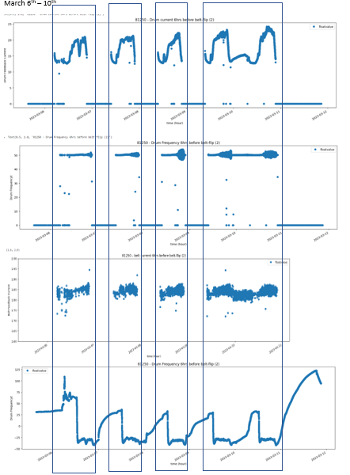

# Fault-Prediction-for-Industrial-Motors-using-Machine-Learning
Predictive Maintenance of Induction Motors using Deep Learning Anomaly Detection using an Regression (Isolation Forest).

## Steps 1: EDA
Exploratory data analysis is broadly applied to observe and visualize main characteristics of data.

 

Below is an example of Anomaly from a real case in practical, the oscillation of frequency of motor drive can be found. The purpose of the first part of work is to detect/predict oscillcation with ML tools.

## Steps 2: Data cleaning and preparing
The dataset includes motor currents, frequencies, and PID parameters for more than 40 motors in 1 year. it's inpossible to label all data. Therefore, we are going to use unsupervised ML methods, and only label ~30 anomaly cases to evalute the production's by models.
